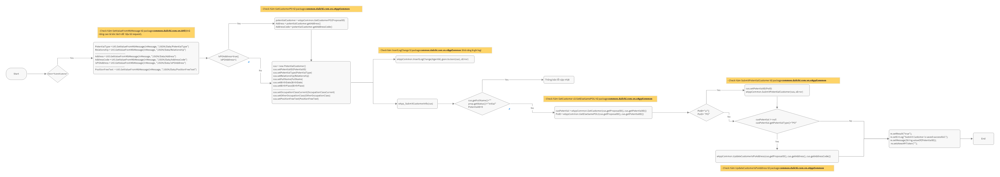

## Message Flow deduced from Java Compute Node


## Integration server configurations
1. Configure your datasource (MSSQL) by editing the `odbc.ini`
```
[DATASOURCE]                                                            <---- Specify your datasource name, this is the name you will specify in setdbparams.txt
Driver=/usr/opt/IBM/mqsi/12.0.5.0/server/ODBC/drivers/lib/UKsqls95.so   <---- Keep it to your IBM App Connect version
Description=DataDirect ODBC SQL Server Wire Protocol
Database=SQLSERVERDB                                                    <---- Specify your database name
HostName=my-machine.hursley.ibm.com                                     <---- Specify your database hostname or IP
PortNumber=1433                                                         <---- Specify your database server port, default is 1433
AnsiNPW=1
LoginTimeout=0
QueryTimeout=0
```
2. Configure your datasource (MSSQL) credentials by editing the `setdbparams.txt`
```
odbc::DATASOURCE USERNAME password
           ^         ^        ^
           |         |        |
   your datasource   |        |
         name        |        |
                  your db     |
                  username    |
                           your db
                           password
```
3. Build your image using the file `docker/Dockerfile`
4. Deploy your application to OpenShift Cluster